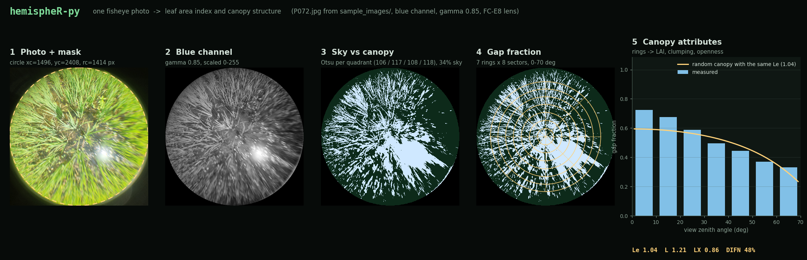
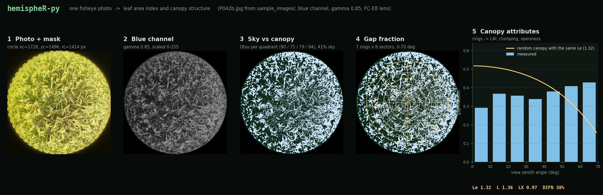

<div align="center">

# hemispheR-py

**Leaf area index and canopy structure from a single fisheye photo — in pure Python, with no OpenCV and no R.**

[](https://github.com/realgauravvyas/hemispheR-py/actions/workflows/ci.yml)


[](https://featherfield.org/)

[**Website & live demo**](https://featherfield.org/) ·
[**Android app**](https://fac.iitg.ac.in/dmandal/Agro-geoinformaticsLab/tools.html) ·
[**Researcher page**](https://fac.iitg.ac.in/dmandal/Agro-geoinformaticsLab/people.html) ·
[**Cite**](#citation)

</div>



*One of the bundled sample photos, run through the real pipeline: `python docs/make_figures.py` regenerates this image.*

---

## What it does

Point it at an upward-facing hemispherical photo of a crop or forest canopy and it returns the numbers ecologists, foresters and agronomists use to describe how much light a canopy lets through:

| Output | Meaning |
|---|---|
| **Le** | Effective leaf area index — from the average gap fraction per zenith ring (assumes randomly placed leaves) |
| **L** | Corrected ("true") LAI — Miller's formula applied per azimuth segment, which accounts for clumping |
| **LX** | Clumping index, `Le / L` (1 = random, lower = more clumped) |
| **LXG1, LXG2** | Alternative clumping-index estimates, as in the R package |
| **DIFN** | Diffuse non-interceptance — canopy openness, in % of sky that gets through |
| **MTA.ell, x** | Mean leaf tilt angle and the ellipsoidal leaf-angle parameter (x = 1 spherical, < 1 planophile, > 1 erectophile) |
| **Gap fraction table** | Sky fraction in every zenith ring × azimuth sector |

It is a from-scratch Python port of the hemispherical-photography workflow popularised by the R package [hemispheR](https://cran.r-project.org/package=hemispheR). The reference implementations are R packages that lean on a heavy geospatial / OpenCV stack; this one needs only `numpy`, `pandas` and `Pillow`, so the same pipeline runs anywhere Python does — a laptop, a Raspberry Pi, a notebook, or [your phone](#android-app).

## Contents

[Quick start](#quick-start) · [How it works](#how-it-works) · [Settings](#settings) · [Three ways to use it](#three-ways-to-use-it) · [Example output](#example-output) · [Tests](#tests) · [Repository layout](#repository-layout) · [Links](#links) · [Citation](#citation) · [Acknowledgements](#acknowledgements) · [License](#license)

## Quick start

```bash
git clone https://github.com/realgauravvyas/hemispheR-py
cd hemispheR-py
pip install numpy pandas pillow          # add matplotlib to see the plots
python core/hemispherR-py.py             # runs on the bundled sample photo
```

To analyse your own photo, edit the `CONFIG` dictionary at the top of [`core/hemispherR-py.py`](core/hemispherR-py.py) — at minimum `filename` and the circular mask `circ_mask` (or set it to `None` to auto-detect) — and run it again. Every parameter is explained in [`core/CONFIG_README.txt`](core/CONFIG_README.txt).

## How it works

1. **Import** — mask the circular fisheye field of view (given as `xc, yc, rc`, or auto-detected), choose a channel (**blue** separates sky from canopy best for upward shots), apply gamma correction and scale to 0–255.
2. **Binarize** — Otsu's method splits sky from canopy, once for the whole image or separately per compass quadrant (`zonal=True`) to cope with uneven lighting.
3. **Gap fraction** — map every pixel to its view zenith angle through the lens model (`equidistant` or the Nikon `FC-E8` converter), bin into rings × sectors and take the fraction of sky pixels in each.
4. **Canopy attributes** — invert Beer–Lambert over the rings (Miller's formula) for Le, repeat per sector for L, and derive the clumping index, openness and leaf-angle parameters.

## Settings

| Parameter | Default | What it does |
|---|---|---|
| `circ_mask` | `{xc, yc, rc}` | Circle (pixels) where the fisheye image sits in the frame; `None` auto-detects |
| `channel` | `3` (blue) | `1/2/3` = R/G/B, or `"Luma"`, `"2BG"`, `"RGB"`, `"GEI"`, `"GLA"`, `"BtoRG"` for downward-facing shots |
| `gamma` | `0.85` | Brightness correction (`< 1` brightens) |
| `zonal` | `True` | One Otsu threshold per N/E/S/W quadrant instead of one global threshold |
| `manual_threshold` | `None` | Fixed threshold 0–255 instead of Otsu |
| `lens` | `"FC-E8"` | Projection model: `"equidistant"` or `"FC-E8"` |
| `startVZA` / `endVZA` | `0` / `70` | Zenith range analysed (70° follows the LAI-2000 convention) |
| `nrings` / `nseg` | `7` / `8` | Number of zenith rings and azimuth sectors |

## Three ways to use it

### 1. Python script / library

```python
import importlib.util

spec = importlib.util.spec_from_file_location("hemispherR_py", "core/hemispherR-py.py")
hp = importlib.util.module_from_spec(spec); spec.loader.exec_module(hp)

img    = hp.import_fisheye("sample_images/P072.jpg", channel=3, gamma=0.85,
                           circ_mask={"xc": 1496, "yc": 2408, "rc": 1414}, message=False)
binary = hp.binarize_fisheye(img, method="Otsu", zonal=True)
gaps   = hp.gapfrac_fisheye(binary, lens="FC-E8", endVZA=70, nrings=7, nseg=8)
print(hp.canopy_fisheye(gaps)[["Le", "L", "LX", "DIFN"]])
```

### 2. Streamlit web app

An interactive UI: upload a photo, adjust the mask, tune settings and watch each step.

```bash
cd streamlit_app
pip install -r requirements.txt
streamlit run app.py
```

Four tabs walk through the pipeline — **Import → Binarize → Gap Fraction → Canopy Attributes** — with logs and metrics at each step. More in [`streamlit_app/README.md`](streamlit_app/README.md).

### 3. Android app

[`android_app/`](android_app) is a Kotlin app (**Canopy Analyzer**, `minSdk 26`) with the same pipeline running on the device: capture with the camera or pick from the gallery, **batch analysis**, results and saved-results screens, visualisations, and data export. A prebuilt APK is available from the lab's [tools page](https://fac.iitg.ac.in/dmandal/Agro-geoinformaticsLab/tools.html).

## Example output

Running `python core/hemispherR-py.py` on the bundled `P072.jpg` prints:

```text
      id   Le    L   LX  LXG1  LXG2  DIFN  MTA.ell    x   ...   thd
P072.jpg 1.04 1.21 0.86  0.63  0.49  47.7     62.9 0.81   ...   106_117_108_118
```

A second sample, `P042b.jpg` (a denser, more uniform canopy), gives `Le 1.32 · L 1.36 · LX 0.97 · DIFN 38 %`:

<details>
<summary>Show the pipeline for P042b</summary>



</details>

Numbers for both photos are also saved in [`docs/images/results.json`](docs/images/results.json).

## Tests

```bash
pip install pytest
python -m pytest
```

The suite checks the thresholding, verifies that exact Beer–Lambert gap fractions return exactly the LAI they were built from, and pins the full pipeline's output on a sample photo. It runs on every push via GitHub Actions.

## Repository layout

```text
core/                  the algorithm — import → binarize → gap fraction → canopy metrics
  hemispherR-py.py       single-file pipeline, CONFIG dict at the top
  CONFIG_README.txt      parameter-by-parameter reference
streamlit_app/         interactive web UI
android_app/           Kotlin Android app (Canopy Analyzer)
sample_images/         two example hemispherical photos
docs/                  figures and the script that regenerates them
tests/                 pytest suite
```

## Links

- 🌐 **Featherfield** — the open-source field-tools project this belongs to: <https://featherfield.org/> (with an in-browser demo that reproduces this pipeline)
- 📱 **Android app (APK)** and lab tools: <https://fac.iitg.ac.in/dmandal/Agro-geoinformaticsLab/tools.html>
- 👤 **Researcher page**, Agro-geoinformatics Lab, IIT Guwahati: <https://fac.iitg.ac.in/dmandal/Agro-geoinformaticsLab/people.html>
- 📦 **hemispheR** (R, MIT) on CRAN: <https://cran.r-project.org/package=hemispheR>
- 📄 Chianucci & Macek (2023), *Agricultural and Forest Meteorology*: <https://doi.org/10.1016/j.agrformet.2023.109470>
- 🧑‍💻 Author's portfolio: <https://realgauravvyas.github.io/>

## Citation

If you use this software, please cite it (GitHub's **Cite this repository** button reads [`CITATION.cff`](CITATION.cff)) **and** the original package:

> Chianucci, F., & Macek, M. (2023). hemispheR: an R package for fisheye canopy image analysis. *Agricultural and Forest Meteorology*. https://doi.org/10.1016/j.agrformet.2023.109470

## Acknowledgements

hemispheR-py began as a research project at the **Agro-geoinformatics Lab, IIT Guwahati**. It follows the workflow, function names and defaults of the R package **hemispheR** by Francesco Chianucci and Martin Macek, to whom the method and its reference implementation belong. Method references: Miller (1967) for the gap-fraction inversion; Lang & Xiang (1986) for the log-averaged clumping estimate; Otsu (1979) for thresholding.

## License

[MIT](LICENSE) © 2026 Gaurav Vyas. Questions, bug reports and ideas are welcome — please [open an issue](https://github.com/realgauravvyas/hemispheR-py/issues).
